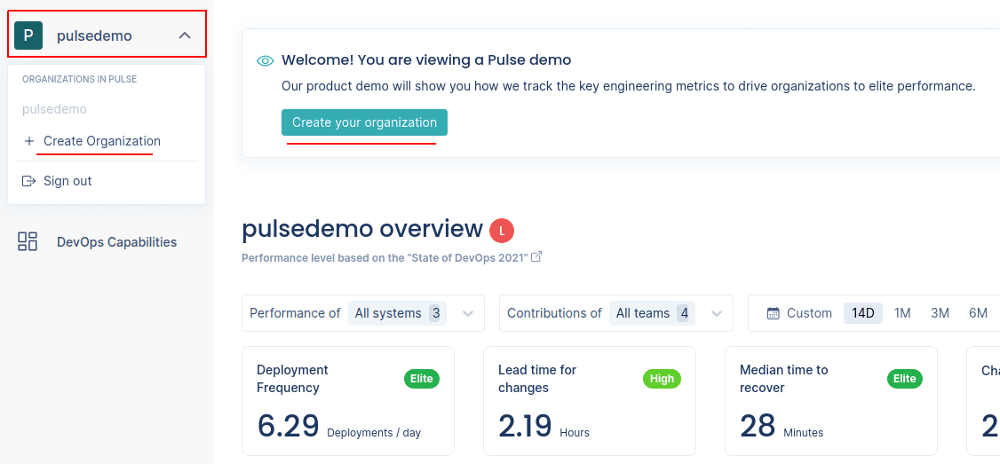
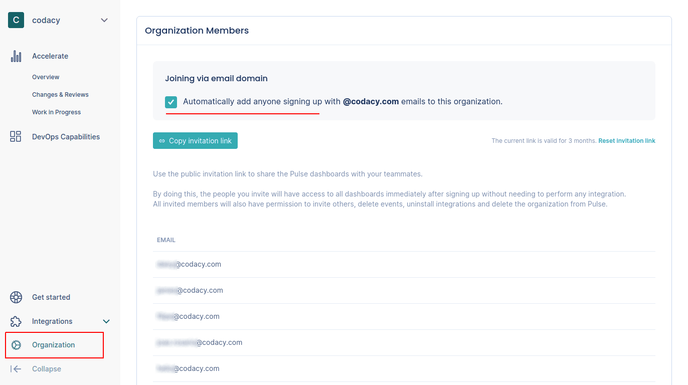

# Getting started with Pulse

Pulse displays the following metrics to provide insights into the current and historic performance of your software delivery process:

-   [Accelerate metrics](metrics/accelerate.md)
-   [Lead time and review metrics](metrics/lead-time-reviews.md)
-   [Work in progress metrics](metrics/work-in-progress.md)

To calculate these metrics, you must complete these main steps to set up Pulse and to collect information from key events of your particular software development workflow:

1.  **Creating your organization on Pulse**

    Your organization on Pulse will aggregate and present all information relevant to your software development workflow.

1.  **Pushing data to Pulse**

    Send data about the key events in your software delivery workflow to feed the Pulse dashboards in real time.

1.  **Sharing access with teammates**

    Invite your teammates to your Pulse organization to share the access to the dashboards and metrics.

## 1. Creating your organization on Pulse

You must create an organization on Pulse to start the onboarding. Click the link in the welcome banner at the top of the page and follow the instructions.

To add more organizations, click the name of the current organization on the top left-hand corner and select **New Organization**.

## 2. Pushing data to Pulse

Currently, Pulse provides a push-based integration with your workflow using one of the following alternatives:

-   **One-click integrations**

    Pulse currently supports the following "one-click" integrations that simplify the process of setting up your workflows to send data to Pulse:

    -   **[GitHub integration](one-click-integrations/github-integration.md):** reports changes and deployments
    -   **[PagerDuty integration](one-click-integrations/pagerduty-integration.md):** reports incidents

    We plan to continue developing integrations for the most popular Git providers, CI/CD platforms, and incident management tools.

-   **[Pulse CLI](cli/cli.md)**

    The Pulse CLI is a binary that you can use to push data to Pulse directly from your CI/CD workflows.

-   **[Pulse Ingestion API](https://ingestion.pulse.codacy.com/v1/api-docs){: target="_blank"}**

    Use the Pulse Ingestion API in scenarios where it may not be feasible to use the CLI to send data to Pulse, such as when you have the data inside an application.

!!! note
    We recommend that you use the integrations that match your stack because they're faster to set up.

## 3. Sharing access with teammates

Share the Pulse dashboards with your teammates to bring more visibility to the metrics.

The most convenient way of ensuring that all the members of your company have access to the Pulse dashboards is by enabling the feature **Joining via email domain** on the **Organization members** page. When this option is enabled, anyone who signs up to Pulse using an email address from your company is automatically added to your Pulse organization.

Alternatively, copy the invitation link from the **Organization members** page and share the link with specific people. A convenient way to do this is to share and pin the link on your team's chat. The link is valid for 3 months, but you can refresh it at any moment.

Newcomers will have access to all dashboards immediately after signing up without needing to perform any integration.
