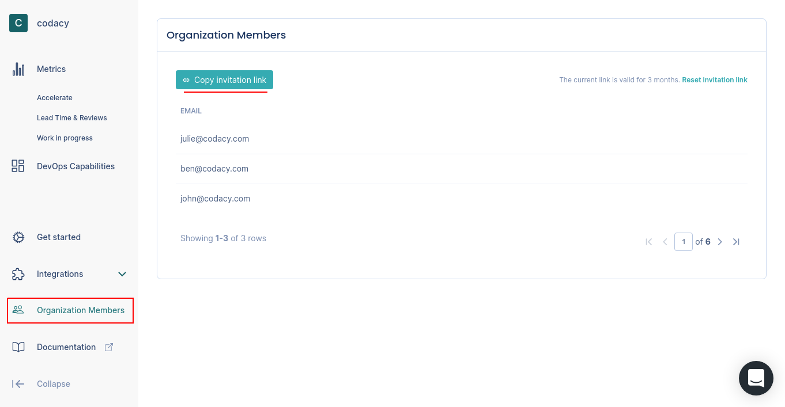

# Integrating with Pulse

Pulse displays metrics that provide insights into the current and historic performance of your software delivery process. To calculate these metrics, Pulse must collect information from key events of your particular software development workflow.

<!--TODO Include this information about supporting more one-click integrations:

Pulse is developing "one-click integrations" for the most popular Git providers, CI/CD platforms, and incident management tools. These integrations simplify the process of setting up your workflows to send data to Pulse.
-->

Currently, Pulse provides a push-based integration with your workflow using either "one-click integrations" or the Pulse CLI:

-   **[GitHub integration](one-click-integrations/github-integration.md)** (reports changes and deployments)
-   **[PagerDuty integration](one-click-integrations/pagerduty-integration.md)** (reports incidents)
-   **[Pulse CLI](cli/installing-the-pulse-cli.md)** (reports changes, deployments, and incidents)

We recommend that you use the integrations that match your stack because they're faster to set up.

## Creating an organization

You must create your own organization on Pulse to start the onboarding. Click the link in the welcome banner at the top of the page and follow the instructions.

To add more organizations, click the name of the current organization on the top left-hand corner and select **New Organization**.

## Sharing access with teammates

Share the Pulse dashboards with your teammates to bring more visibility to the metrics.

To do this, copy the link on the **Organization members** page and share it with your teammates. A convenient way to do this is to share and pin the link on your team's chat.

By doing this, the people you invite will have access to all dashboards immediately after signing up without needing to perform any integration.

The link is valid for 3 months, but you can refresh it at any moment.
