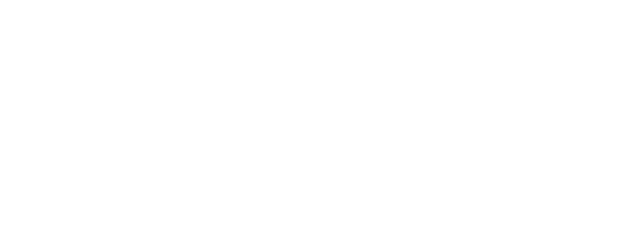

# Lead and cycle time metrics

Monitoring you team's lead time and cycle time allows you to understand if you're improving the ability to deliver value to customers.



-   [Lead time](#lead-time)
-   [Cycle time](#cycle-time)

!!! note
    Pulse calculates lead time and cycle time based on the state changes of issues **that are already closed** in Jira, independently of the resolution. This means that:

    -   **If you reopen** a completed issue, Pulse stops considering the issue while calculating the metrics. If the issue is completed again, Pulse takes into account the last completed timestamp.

    -   **If you change the type or the project** of a completed issue, Pulse reflects the change on the dashboards, transitioning the issue history to the new project if relevant.
    
        Note that this change doesn't affect the overall calculation of the lead time or cycle time metrics.

## Lead time

Time between creating an issue in the backlog and completing the issue.

Pulse calculates lead time for completed issues, taking into account that issues can transition from **Completed** back to another status.

```text
last issue completed timestamp - issue created timestamp
```

## Cycle time

Time between commiting to work on an issue (such as at the start of a sprint) and completing the issue. Cycle time is a subpart of lead time.

Pulse calculates cycle time for completed issues, taking into account that issues can transition from **In progress** back to another status besides **Completed**.

!!! note
    When calculating cycle time, Pulse considers that:

    -   Issues are in progress when they transition to any Jira status belonging to the **In Progress** status category (represented by the blue color in Jira).
    -   Issues that have a status belonging to the **To Do** status category (represented by the grey color in Jira) don't contribute to cycle time.

```text
sum all (issue exited in progress timestamp - issue entered in progress timestamp)
```

## See also

-   Report data to Pulse using the [Jira integration](../one-click-integrations/jira-integration.md)
