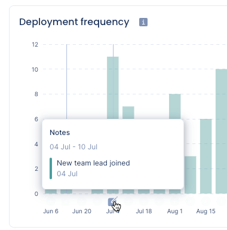
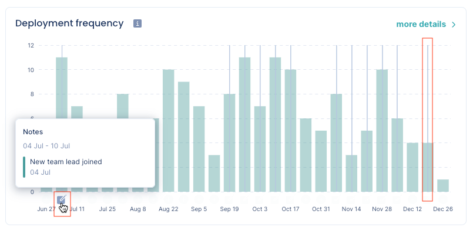
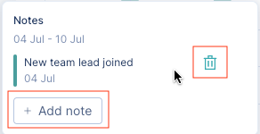

# Tracking the impact of changes

Some changes in your organization, either internal or external to the environment, can impact your software delivery process. For example, changes in the team structure or membership, teams adopting new working processes, or major events affecting the system stability, might have a positive or negative impact on the performance of your teams.

Pulse enables you to track and correlate the impact that specific changes might have on the performance of your teams using **notes** to signal actions or events that took place on a specific date.

Pulse shows your organization notes across the different dashboards - [Accelerate overview](metrics/accelerate.md), [Changes & Reviews](metrics/accelerate-changes.md), and [Lead & Cycle time](metrics/lead-cycle-time.md). This way you can compare each performance metric before and after a specific change.

!!! note
    -   Notes are **global to the organization**. Any member can view, add, or delete any note.
    -   Pulse dashboards show the latest 100 notes for the selected time range.

## Using notes

Pulse dashboards show a vertical line when there are notes for that period. Hover over a line to display the notes icon below, near the date axis. Click the notes icon to open the notes card and see all the notes for that period.

On the notes card, you can add new notes for the same period and delete existing notes.

To add a new note for a specific date period, hover the mouse below that period near the date axis and click the add icon.

