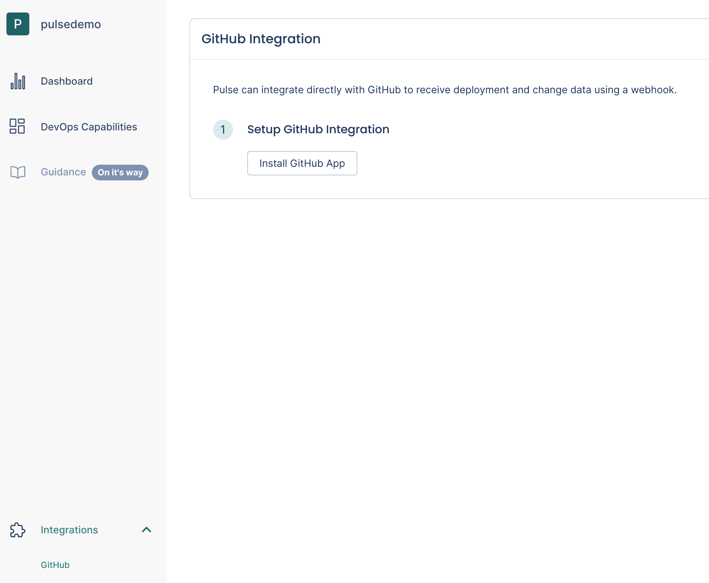
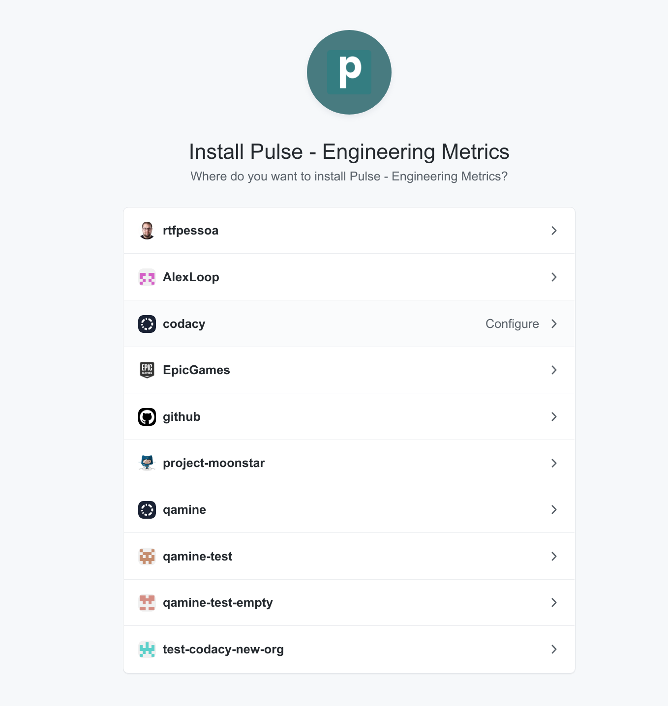
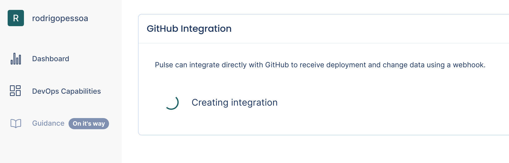
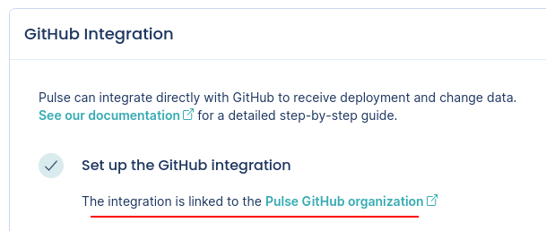
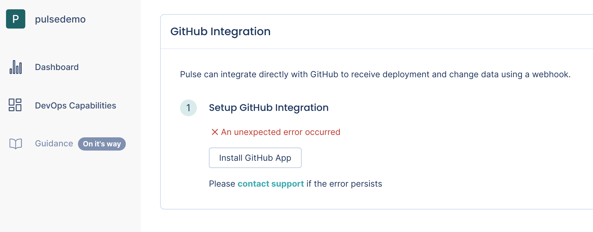
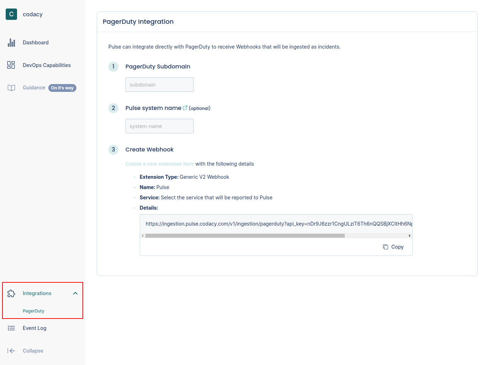
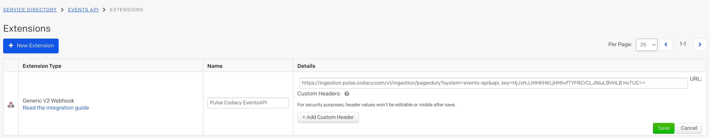

# One-click integrations

Pulse is developing "one-click integrations" for the most popular Git providers, CI/CD platforms, and incident management tools. These integrations simplify the process of setting up your workflows to send data to Pulse.

## GitHub

Pulse integrates directly with GitHub to receive data about changes and deployments, necessary to calculate the metrics:

-   [Lead time for changes](metrics/accelerate.md#lead-time-for-changes) (including the sub-metrics [Time to open](metrics/accelerate.md#time-to-open) and [Time to review](metrics/accelerate.md#time-to-review))
-   [Deployment frequency](metrics/accelerate.md#deployment-frequency)

!!! important
    Consider the following before using the GitHub integration:

    -   The integration obtains information about deployments from Git tags that follow the [SemVer](https://semver.org) convention, excluding pre-release versions, but allowing release prefixes. Valid tags e.g.: `1.0.0`, `v2.3.4`

    -   The integration obtains the deployment date from either the creation date of [annotated tags](https://git-scm.com/book/en/v2/Git-Basics-Tagging#_annotated_tags) or the timestamp when the integration receives the webhook calls for [lightweight tags](https://git-scm.com/book/en/v2/Git-Basics-Tagging#_lightweight_tags).

        However, since webhook calls can be delayed, the deployment date on Pulse could be imprecise and impact the metric **Lead time for changes**.

    -   The integration obtains the set of changes that belong to a deployment from the list of commits between the tag of that deployment and the previous tag.

        Because of this, the integration discards the first SemVer tag in the repository since there is no previous tag to compare with.

To set up the GitHub integration:

1.  Make sure that you're creating a Git tag on your repositories for each successful deployment to production, or whenever you make a new release available to any user of your application:

    ```bash
    git tag -a X.Y.Z -m "<Deployment or release message>"
    ```

    Where X.Y.Z must be a valid SemVer version without pre-release information.

1.  On Pulse, [navigate to **Integrations** and then select **GitHub**](https://app.pulse.codacy.com/integrations/github){: target="_blank"}.

    

1.  Click **Install GitHub App** and follow the instructions on the GitHub UI to install the app in the desired organization.

    

1.  Wait while Pulse creates the integration and the webhook on GitHub for you.

    

In case of success you should be redirected to a page like:



If there is an error as displayed below please [contact support](mailto:pulsesupport@codacy.com).



## PagerDuty

Pulse integrates directly with PagerDuty to receive data about incidents, necessary to calculate the metrics [Median time to recover](metrics/accelerate.md#median-time-to-recover) and [Change failure rate](metrics/accelerate.md#change-failure-rate).

To set up the PagerDuty integration:

1.  On Pulse, [navigate to **Integrations** and then select **PagerDuty**](https://app.pulse.codacy.com/integrations/pagerduty){: target="_blank"}.

    

1.  Fill in the necessary details:

    -   **PagerDuty subdomain:** Your custom PagerDuty subdomain. For example, `mysubdomain` if you use the URL `https://mysubdomain.pagerduty.com` to access PagerDuty.
    -   **Pulse system name:** Name of the [system](https://docs.pulse.codacy.com/#before-you-begin) to associate with the incidents reported by this integration.

1.  Follow the instructions on the Pulse UI to create a new webhook on PagerDuty using the provided URL. For example:

    
