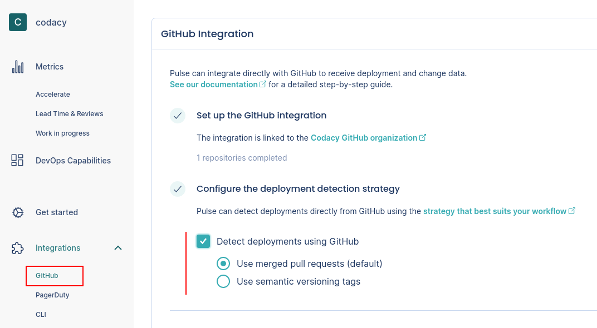
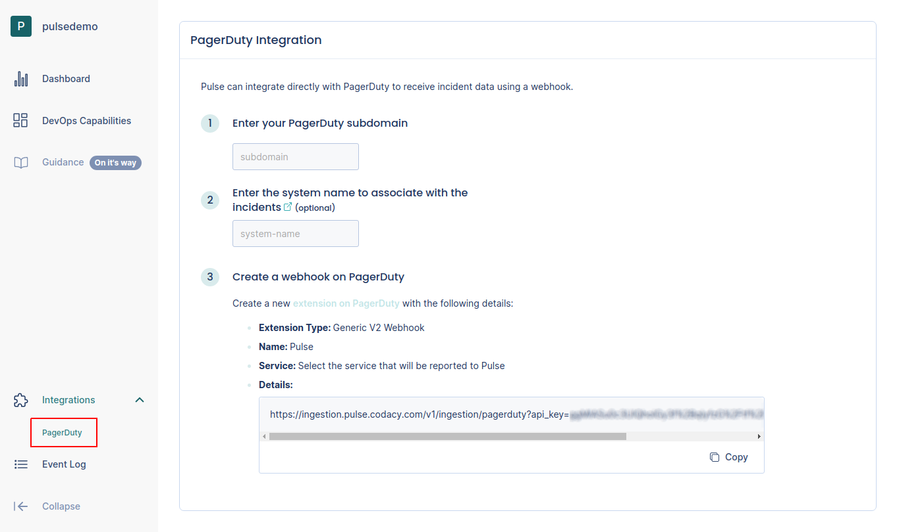

# One-click integrations

Pulse is developing "one-click integrations" for the most popular Git providers, CI/CD platforms, and incident management tools. These integrations simplify the process of setting up your workflows to send data to Pulse.

## GitHub

Pulse integrates directly with GitHub to receive data about changes and deployments, necessary to calculate the metrics:

-   [Lead time for changes](metrics/accelerate.md#lead-time-for-changes), including the following drill-down metrics:

    -   [Lead time for changes sub-metrics](metrics/lead-time-reviews.md#lead-time-for-changes-sub-metrics)

    -   [Review metrics](metrics/lead-time-reviews.md#review-metrics)

    -   [Work in progress metrics](metrics/work-in-progress.md)

-   [Deployment frequency](metrics/accelerate.md#deployment-frequency)

### Setting up the GitHub integration

To set up the GitHub integration:

1.  On Pulse, [expand **Integrations** and select **GitHub**](https://app.pulse.codacy.com/integrations/github){: target="_blank"}.

1.  Click **Install GitHub App** and follow the instructions on the GitHub UI to install the app on your organization.

    !!! important
        You can only install the Pulse GitHub App on an organization and not on your personal account.

    

1.  Wait until you get a confirmation that Pulse successfully created the integration and the webhook on GitHub.

    

    If there was an error please [contact support](mailto:pulsesupport@codacy.com).

### Configuring how Pulse detects deployments {: id="deployment-detection-strategy"}

Optionally, the Pulse GitHub integration can use one of two strategies to automatically detect and measure deployments in your repositories:

-   **Pull requests merged to default branch** (default strategy)

    -   Pulse considers a deployment every pull request that **targets the default branch** of the repository.
    -   The deployment date is the timestamp when the corresponding pull request is merged.
    -   The set of changes in a deployment is the list of commits in the corresponding pull request. Pulse correctly tracks your changes even if you squash the commits when merging the pull request.

-   **Git tags following the SemVer specification**

    -   Pulse considers a deployment every Git tag that follows the [SemVer](https://semver.org) convention, excluding pre-release versions but allowing release prefixes. For exmple, the following are valid tags: `1.0.0`, `v2.3.4`.

        To use this strategy, make sure that you're creating Git tags on your repositories for each successful deployment to production, or whenever you make a new release available to any user of your application:

        ```bash
        git tag -a MAJOR.MINOR.PATCH -m "<Deployment or release message>"
        ```

        Where `MAJOR.MINOR.PATCH` must be a valid SemVer version without pre-release information.

    -   The deployment date is either the creation date of [annotated tags](https://git-scm.com/book/en/v2/Git-Basics-Tagging#_annotated_tags) or the timestamp when Pulse receives the webhook calls for [lightweight tags](https://git-scm.com/book/en/v2/Git-Basics-Tagging#_lightweight_tags).

        Keep in mind that since webhook calls can be delayed, the deployment date on Pulse could be imprecise and impact the metric **Lead time for changes**.

    -   The set of changes that belong to a deployment is the list of commits between the tag of that deployment and the previous tag. Because of this, Pulse discards:

        -   The first SemVer tag in the repository since there is no previous tag to compare with.
        -   Any tag that does not have a common ancestor (commit) with its previous tag, since Pulse cannot obtain the changes between them.

If the automatic deployment detection is turned off, Pulse doesn't detect deployments using GitHub events and you must report deployments using the Pulse CLI or the API. This is useful if none of the automatic deployment detection strategies match your workflow and you must have control over the way Pulse tracks your deployments.

To configure the strategy that Pulse uses to detect deployments:

1.  On Pulse, [expand **Integrations** and select **GitHub**](https://app.pulse.codacy.com/integrations/github){: target="_blank"}.

    Make sure that you have already installed the GitHub App.

1.  Choose the strategy that fits best your workflows, or turn off the automatic deployment detection.

    


## PagerDuty

Pulse integrates directly with PagerDuty to receive data about incidents, necessary to calculate the metrics [Median time to recover](metrics/accelerate.md#median-time-to-recover) and [Change failure rate](metrics/accelerate.md#change-failure-rate).

To set up the PagerDuty integration:

1.  On Pulse, [expand **Integrations** and select **PagerDuty**](https://app.pulse.codacy.com/integrations/pagerduty){: target="_blank"}.

    

1.  Fill in the necessary details:

    -   **PagerDuty subdomain:** Your custom PagerDuty subdomain. For example, `mysubdomain` if you use the URL `https://mysubdomain.pagerduty.com` to access PagerDuty.
    -   **Pulse system name:** Name of the [system](https://docs.pulse.codacy.com/#before-you-begin) to associate with the incidents reported by this integration.

1.  Follow the instructions on the Pulse UI to create a new webhook on PagerDuty using the provided URL. For example:

    
