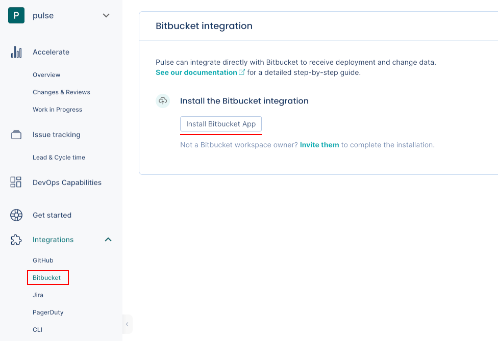

# Bitbucket integration

!!! note
    <!--NOTE Limitation from Bitbucket integration V1-V2-->Pulse's Bitbucket integration is new and still in **Beta**. For now, we only show the [Accelerate metrics](../metrics/accelerate.md) using your merged pull requests to automatically detect deployments.

<!--NOTE Limitation from Bitbucket integration V1-V2-->Pulse integrates with Bitbucket Cloud to receive data about changes and deployments, necessary to calculate the metrics:

-   [Lead time for changes](../metrics/accelerate.md#lead-time-for-changes)

-   [Deployment frequency](../metrics/accelerate.md#deployment-frequency)

## Setting up the Bitbucket integration

!!! note
    -   The Bitbucket integration connects to a specific [workspace](https://support.atlassian.com/bitbucket-cloud/docs/what-is-a-workspace/). You must be the **owner** of that Bitbucket workspace to proceed with the integration setup.
    -   [See below](#bb-permissions) the permissions that Pulse requires from your Bitbucket account.  

To set up the Bitbucket integration:

1.  On Pulse, [expand **Integrations** and select **Bitbucket**](https://app.pulse.codacy.com/integrations/bitbucket){: target="_blank"}.

1.  Click **Install Bitbucket App**.

    

1.  Choose the workspace that you want to connect the integration to and click **Complete setup** to confirm. You can only select a workspace where you have owner permissions.

    

1.  Wait until you get a confirmation that Pulse successfully connected the integration to Bitbucket.

    

If there is an error please [contact support](mailto:pulsesupport@codacy.com).

## Automatic deployment detection using merged pull requests {: id="deployment-detection-merged-pr"}

!!! note
    -   <!--NOTE Limitation from Bitbucket integration V1-V2-->Pulse uses your merged pull requests to automatically detect your deployments. Other strategies to detect deployments will be available with a future version of Pulse.
    -   <!--NOTE Limitation from Bitbucket integration V1-V2-->If you use a [squash merge strategy](https://support.atlassian.com/bitbucket-cloud/docs/merge-a-pull-request/#Merge-strategies) when merging the pull request, Pulse may produce inaccurate accelerate metrics.

-   Pulse considers a deployment every merged pull request that **targets the default branch** of the repository.
-   The deployment date is the timestamp when the corresponding pull request is merged.
-   The set of changes in a deployment is the list of commits in the corresponding pull request.
-   Pulse associates all the Bitbucket user groups of the author of a merged pull request with the corresponding deployment, excluding the user groups with less than two members. Pulse only takes the changes to Bitbucket user groups into account on pull requests merged after those changes.

## Collected data

The table below lists the data that the Bitbucket integration collects from your Bitbucket workspace, together with:

-   The mapping between the data collected from Bitbucket and the [Pulse data model](https://ingestion.pulse.codacy.com/v1/api-docs#tocs_event)
-   The metrics that Pulse displays on the dashboards, calculated using the collected data

<table>
<thead>
<tr>
<th><strong>Data collected from Bitbucket</strong></th>
<th><strong>Mapping to Pulse data model</strong></th>
<th><strong>Used in</strong></th>
</tr>
</thead>
<tbody>
<tr>
    <td>Pull request commits</td>
    <td>
        
Changes:

        <ul>
            <li><code>change_id</code>: commit UUID</li>
            <li><code>time_created</code>: commit author date<a href="#commit-author-date">1</a></li>
            <li><code>system</code>: repository name</li>
        </ul>
    </td>
    <td>Lead time for changes on the <a href="../../metrics/accelerate/">Accelerate Overview dashboard</a></td>
</tr>
<tr>
    <td>Pull requests</td>
    <td>
        
Deployments:

        <ul>
            <li><code>deploy_id</code>: unique pull request identifier</li>
            <li><code>system</code>: repository name</li>
        </ul>
    </td>
    <td>Deployment frequency and Change failure rate on the <a href="../../metrics/accelerate/">Accelerate Overview dashboard</a></td>
</tr>
<tr>
    <td>User groups</td>
    <td>
        
Deployments:

        <ul>
            <li><code>teams</code>: Bitbucket user groups of the author of a deployment<a href="#deployment-teams">2</a></li>
        </ul>
    </td>
    <td>Filters the <a href="../../metrics/accelerate/">Accelerate Overview dashboard</a> by the contributions made by the team</td>
</tr>
</table>

1: Pulse uses the commit author's date since it is more accurate. The committer date can be changed (e.g.: fast-forward) and stop reflecting the real creation date of the change.

2: Adding a new user group or changing the composition of a user group on Bitbucket only affects new data from that moment onwards and doesn't have an immediate impact on the dashboards. Also, deleted user groups on Bitbucket are still visible in Pulse.

## Which permissions does Pulse need from Bitbucket? {: id="bb-permissions"}

Pulse requests only the necessary [permissions/scopes from Bitbucket](https://developer.atlassian.com/cloud/bitbucket/bitbucket-cloud-rest-api-scopes/) to collect changes and deployment data from the repositories in your workspace and [keeps your information secure](https://security.codacy.com/). See below the detailed list of permissions.

<table>
  <colgroup>
    <col width="25%"/>
    <col width="75%"/>
  </colgroup>
  <thead>
    <tr>
      <th>Scope and permissions</th>
      <th>Description</th>
    </tr>
  </thead>
  <tbody>
    <tr>
      <td><code>account</code></td>
      <td>Pulse retrieves the email of the user installing the integration, the user's workspaces and its membership, and the user groups.</td>
    </tr>
    <tr>
      <td><code>repository</code></td>
      <td>Pulse retrieves repository information to get the default branch and the list of commits.</td>
    </tr>
    <tr>
      <td><code>pullrequest</code></td>
      <td>Pulse retrieves pull request information to calculate several metrics presented on the dashboards. <a href="#collected-data">See the details here.</a></td>
    </tr>
    <tr>
      <td><code>webhook</code></td>
      <td>Pulse creates webhooks to track new or deleted workspaces.
       Pulse creates webhooks subscribed to the following events as a trigger to gather the corresponding data in real time:
      <ul>
        <li><code>pullrequest:created</code>: pull requests creation</li>
        <li><code>pullrequest:updated</code>: pull requests edition</li>
        <li><code>pullrequest:fulfilled</code>: pull requests merge</li>
        <li><code>pullrequest:rejected</code>: pull requests decline</li>
        <li><code>pullrequest:approved</code>: pull requests approval</li>
        <li><code>pullrequest:unapproved</code>: deletion of pull requests approval</li>
        <li><code>pullrequest:changes_request_created</code>: pull requests change request</li>
        <li><code>pullrequest:changes_request_removed</code>: deletion of pull requests change request</li>
        <li><code>repo:push</code>: pushes of tags to a repository</li>
      </ul>
      Pulse creates webhooks subscribed to the following events as a trigger to historical data import:
      <ul>
        <li><code>repo:transfer</code>: repositories tranfer acceptance</li>
        <li><code>repo:fork</code>: repositories fork</li>
      </ul>
      </td>
    </tr>
  </tbody>
</table>

## See also

-   [Accelerate metrics](../metrics/accelerate.md)
