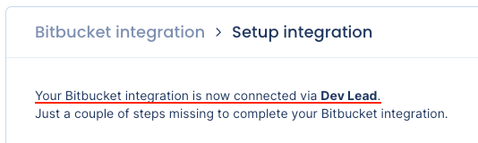
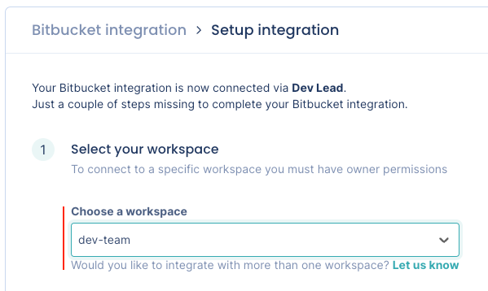
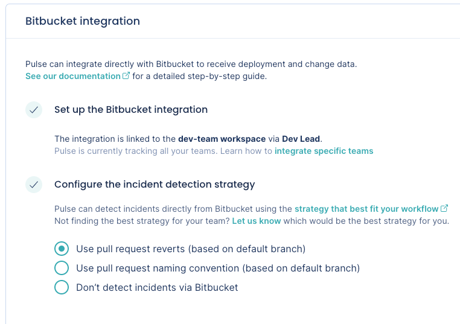

# Bitbucket integration

Pulse integrates with Bitbucket Cloud to receive data about changes, deployments, and incidents, necessary to calculate the Accelerate metrics:

-   [Deployment frequency](../metrics/accelerate.md#deployment-frequency)

-   [Lead time for changes](../metrics/accelerate.md#lead-time-for-changes), including the following drill-down metrics:

    -   [Changes metrics](../metrics/accelerate-changes.md#changes-metrics)

    -   [Reviews metrics](../metrics/accelerate-changes.md#reviews-metrics)

    -   [Work in progress metrics](../metrics/accelerate-wip.md)

-   [Time to recover](../metrics/accelerate.md#time-to-recover)

-   [Change failure rate](../metrics/accelerate.md#change-failure-rate)

## Setting up the Bitbucket integration

!!! note
    -   The Bitbucket integration connects to a specific [workspace](https://support.atlassian.com/bitbucket-cloud/docs/what-is-a-workspace/). You must be the **owner** of that Bitbucket workspace to proceed with the integration setup.
    -   [See below](#bb-permissions) the permissions that Pulse requires from your Bitbucket account.  

To set up the Bitbucket integration:

1.  On Pulse, [expand **Integrations** and select **Bitbucket**](https://app.pulse.codacy.com/integrations/bitbucket){: target="_blank"}.

1.  Click **Install Bitbucket App**.

    

1.  Confirm that Pulse successfully connected the integration to Bitbucket. If there is an error please [contact support](mailto:pulsesupport@codacy.com).

    

1.  Choose the workspace that you want to connect the integration to. You can only select a workspace where you have owner permissions.

    

1.  Choose the strategy to detect incidents that best fits your workflows. See the [section below](#incident-detection-strategy) for a detailed description of each option.

    

1.  Click **Complete setup**.

Your Bitbucket integration is now complete. Pulse will start loading your data for the last 90 days.

## Automatic deployment detection using merged pull requests {: id="deployment-detection-merged-pr"}

!!! note
    -   <!--NOTE Limitation from Bitbucket integration V1-V2-->Pulse uses your merged pull requests to automatically detect your deployments. Other strategies to detect deployments will be available with a future version of Pulse.
    -   <!--NOTE Limitation from Bitbucket integration V1-V2-->If you use a [squash merge strategy](https://support.atlassian.com/bitbucket-cloud/docs/merge-a-pull-request/#Merge-strategies) when merging the pull request, Pulse may produce inaccurate accelerate metrics.

-   Pulse considers a deployment every merged pull request that **targets the default branch** of the repository.
-   The deployment date is the timestamp when the corresponding pull request is merged.
-   The set of changes in a deployment is the list of commits in the corresponding pull request.
-   Pulse associates all the Bitbucket user groups of the author of a merged pull request with the corresponding deployment, excluding the user groups with less than two members. Pulse only takes the changes to Bitbucket user groups into account on pull requests merged after those changes.

## Automatic incident detection strategies {: id="incident-detection-strategy"}

The Pulse Bitbucket integration can detect **incidents** automatically using the following strategies:

-   [Pull request reverts](#bb-incident-pr-revert)
-   [Pull request naming convention](#bb-incident-naming)

You can also choose [not to detect incidents via Bitbucket](#bb-incident-not-detect).

### Use pull request reverts (based on default branch) {: id="bb-incident-pr-revert"}

-   Pulse bases incident detection on [pull request reverts](https://support.atlassian.com/bitbucket-cloud/docs/merge-a-pull-request/#Revert-a-merged-pull-request).
-   Pulse considers an incident any pull request that **targets the default branch** of the repository merged from a branch whose name starts with `revert-pr-`, getting the number of the reverted pull request from the branch name, `revert-pr-<pull request number>`. If you change the name of the branch created by Bitbucket when you revert a pull request, Pulse may not be able to obtain the incident data correctly.
-   The incident creation date is the timestamp when the reverted pull request was initially merged. If Pulse can't get the reverted pull request number from the branch name, the incident creation date is the timestamp of the first commit to the incident pull request.
-   Pulse associates incidents to the system matching the repository name.

### Use pull request naming convention (based on default branch) {: id="bb-incident-naming"}

-   Pulse executes the same incident detection mechanism based on [pull request reverts](#bb-incident-pr-revert) using the naming convention you define instead of the default branch prefix `revert-pr-`.

-   You can define the prefix for the branch name or the pull request title to match the naming convention of your workflow.

    

### Don't detect incidents via Bitbucket {: id="bb-incident-not-detect"}

-   Pulse doesn't detect incidents automatically using Bitbucket events.

    Choose this option if you want to send to Pulse the information about your **incidents** using another Pulse integration - [PagerDuty one-click integration](pagerduty-integration.md), [Pulse CLI](../cli/cli.md), or [Ingestion API](https://ingestion.pulse.codacy.com/v1/api-docs) - or if you don't want Pulse to track incidents data.

## Collected data

The table below lists the data that the Bitbucket integration collects from your Bitbucket workspace, together with:

-   The mapping between the data collected from Bitbucket and the [Pulse data model](https://ingestion.pulse.codacy.com/v1/api-docs#tocs_event)
-   The metrics that Pulse displays on the dashboards, calculated using the collected data

<table>
<thead>
<tr>
<th><strong>Data collected from Bitbucket</strong></th>
<th><strong>Mapping to Pulse data model</strong></th>
<th><strong>Used in</strong></th>
</tr>
</thead>
<tbody>
<tr>
    <td>Pull request commits</td>
    <td>
        
Changes:

        <ul>
            <li><code>change_id</code>: commit UUID</li>
            <li><code>time_created</code>: commit author date<a href="#commit-author-date">1</a></li>
            <li><code>system</code>: repository name</li>
        </ul>
    </td>
    <td>Lead time for changes on the <a href="../../metrics/accelerate/">Accelerate Overview dashboard</a></td>
</tr>
<tr>
    <td>Pull requests</td>
    <td>
        
Deployments:

        <ul>
            <li><code>deploy_id</code>: unique pull request identifier</li>
            <li><code>timestamp_created</code>: merge date of the pull request</li>
            <li><code>system</code>: repository name</li>
        </ul>
    </td>
    <td>Deployment frequency and Change failure rate on the <a href="../../metrics/accelerate/">Accelerate Overview dashboard</a></td>
</tr>
<tr>
    <td>Pull requests</td>
    <td>
        
Incidents:

        <ul>
            <li><code>incident_id</code>: pull request number</li>
            <li><code>timestamp_created</code>: merge date of the reverted pull request</li>
            <li><code>timestamp_resolved</code>: merge date of the pull request</li>
            <li><code>system</code>: repository name</li>
        </ul>
    </td>
    <td>Time to recover and Change failure rate on the <a href="../../metrics/accelerate/">Accelerate Overview dashboard</a></td>
</tr>
<tr>
    <td>Pull requests</td>
    <td>
        -
    </td>
    <td><a href="../../metrics/accelerate-changes/">Changes & Reviews dashboard</a>, <a href="../../metrics/accelerate-wip/">Work in Progress dashboard</a></td>
</tr>
<tr>
    <td>User groups</td>
    <td>
        
Deployments:

        <ul>
            <li><code>teams</code>: Bitbucket user groups of the author of a deployment<a href="#deployment-teams">2</a></li>
        </ul>
    </td>
    <td>Filters the <a href="../../metrics/accelerate/">Accelerate Overview dashboard</a>, <a href="../../metrics/accelerate-changes/">Changes & Reviews dashboard</a>, and <a href="../../metrics/accelerate-wip/">Work in Progress dashboard</a> by the contributions made by the team</td>
</tr>
</table>

1: Pulse uses the commit author's date since it's more accurate. The committer date can be changed (for example, with a fast-forward) and stop reflecting the real creation date of the change.

2: Adding a new user group or changing the composition of a user group on Bitbucket only affects new data starting from that moment and doesn't have an immediate impact on the dashboards. Also, deleted user groups on Bitbucket are still visible in Pulse.

## Which permissions does Pulse need from Bitbucket? {: id="bb-permissions"}

Pulse requests only the necessary [permissions/scopes from Bitbucket](https://developer.atlassian.com/cloud/bitbucket/bitbucket-cloud-rest-api-scopes/) to collect changes and deployment data from the repositories in your workspace and [keeps your information secure](https://security.codacy.com/). See below the detailed list of permissions.

<table>
  <colgroup>
    <col width="25%"/>
    <col width="75%"/>
  </colgroup>
  <thead>
    <tr>
      <th>Scope and permissions</th>
      <th>Description</th>
    </tr>
  </thead>
  <tbody>
    <tr>
      <td><code>account</code></td>
      <td>Pulse retrieves the email of the user installing the integration, the user's workspaces and its membership, and the user groups.</td>
    </tr>
    <tr>
      <td><code>repository</code></td>
      <td>Pulse retrieves repository information to get the default branch and the list of commits.</td>
    </tr>
    <tr>
      <td><code>pullrequest</code></td>
      <td>Pulse retrieves pull request information to calculate several metrics presented on the dashboards. <a href="#collected-data">See the details here.</a></td>
    </tr>
    <tr>
      <td><code>webhook</code></td>
      <td>Pulse creates webhooks to track new or deleted workspaces.
       Pulse creates webhooks subscribed to the following events as a trigger to gather the corresponding data in real time:
      <ul>
        <li><code>pullrequest:created</code>: pull requests creation</li>
        <li><code>pullrequest:updated</code>: pull requests edition</li>
        <li><code>pullrequest:fulfilled</code>: pull requests merge</li>
        <li><code>pullrequest:rejected</code>: pull requests decline</li>
        <li><code>pullrequest:approved</code>: pull requests approval</li>
        <li><code>pullrequest:unapproved</code>: deletion of pull requests approval</li>
        <li><code>pullrequest:changes_request_created</code>: pull requests change request</li>
        <li><code>pullrequest:changes_request_removed</code>: deletion of pull requests change request</li>
        <li><code>repo:push</code>: pushes of tags to a repository</li>
      </ul>
      Pulse creates webhooks subscribed to the following events as a trigger to historical data import:
      <ul>
        <li><code>repo:transfer</code>: repositories tranfer acceptance</li>
        <li><code>repo:fork</code>: repositories fork</li>
      </ul>
      </td>
    </tr>
  </tbody>
</table>

## See also

-   [Accelerate metrics](../metrics/accelerate.md)
-   [Changes and reviews metrics](../metrics/accelerate-changes.md)
-   [Work in progress metrics](../metrics/accelerate-wip.md)
