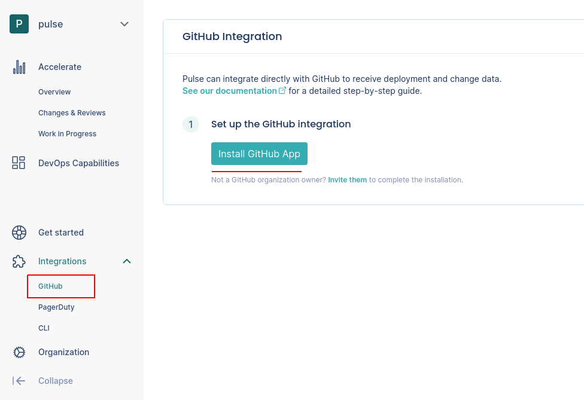
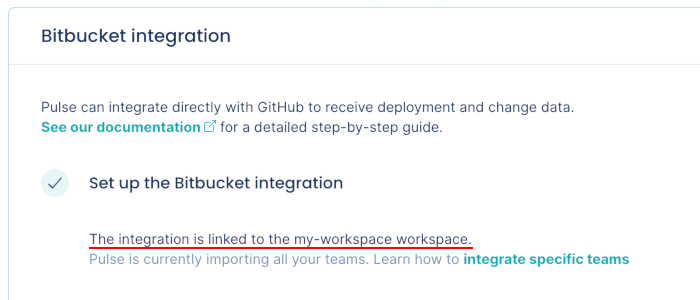
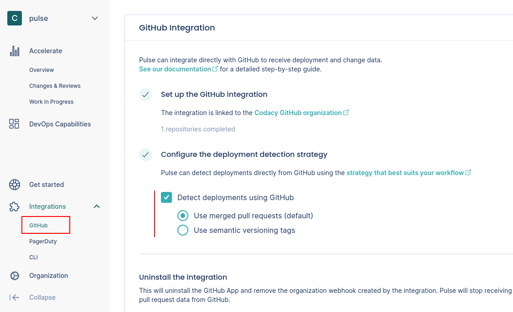

# GitHub integration

Pulse integrates with GitHub Cloud to receive data about changes and deployments, necessary to calculate the metrics:

-   [Lead time for changes](../metrics/accelerate.md#lead-time-for-changes), including the following drill-down metrics:

    -   [Changes metrics](../metrics/accelerate-changes.md#changes-metrics)

    -   [Reviews metrics](../metrics/accelerate-changes.md#reviews-metrics)

    -   [Work in progress metrics](../metrics/accelerate-wip.md)

-   [Deployment frequency](../metrics/accelerate.md#deployment-frequency)

## Setting up the GitHub integration

To set up the GitHub integration:

1.  On Pulse, [expand **Integrations** and select **GitHub**](https://app.pulse.codacy.com/integrations/github){: target="_blank"}.

1.  Click **Install GitHub App** and follow the instructions on the GitHub UI to install the app on your organization.

    !!! important
        You can only install the Pulse GitHub App on an organization and not on your personal account.

    

1.  Wait until you get a confirmation that Pulse successfully created the integration and the webhook on GitHub.

    

    If there was an error please [contact support](mailto:pulsesupport@codacy.com).

1.  Choose the strategy to detect deployments that best fits your workflows, or turn off the automatic deployment detection. See the section below for a detailed description of each option.

    

## Automatic deployment detection strategies {: id="deployment-detection-strategy"}

The following is a detailed description of how the Pulse GitHub integration automatically detects deployment using each detection strategy:

### Use merged pull requests (default)

-   Pulse considers a deployment every merged pull request that **targets the default branch** of the repository.
-   The deployment date is the timestamp when the corresponding pull request is merged.
-   The set of changes in a deployment is the list of commits in the corresponding pull request. Pulse correctly tracks your changes even if you [squash or rebase the commits when merging the pull request](https://docs.github.com/en/repositories/configuring-branches-and-merges-in-your-repository/configuring-pull-request-merges/about-merge-methods-on-github), since Pulse processes all the original commits before any changes to the Git history.
-   Pulse associates all GitHub teams of the author of a merged pull request with the corresponding deployment, excluding teams with less than two members. Pulse only takes changes to GitHub teams into account on pull requests merged after those changes.

### Use semantic versioning tags

-   Pulse considers a deployment every Git tag that follows the [SemVer](https://semver.org) convention, excluding pre-release versions but allowing release prefixes. For example, the following are valid tags: `1.0.0`, `v2.3.4`.

    To use this strategy, make sure that you're creating Git tags on your repositories for each successful deployment to production, or whenever you make a new release available to any user of your application:

    ```bash
    git tag -a MAJOR.MINOR.PATCH -m "<Deployment or release message>"
    ```

    Where `MAJOR.MINOR.PATCH` must be a valid SemVer version without pre-release information. [Check if your versioning syntax is valid](https://regex101.com/r/NVAtiz/1).

-   The deployment date is either the creation date of [annotated tags](https://git-scm.com/book/en/v2/Git-Basics-Tagging#_annotated_tags) or the timestamp when Pulse receives the webhook calls for [lightweight tags](https://git-scm.com/book/en/v2/Git-Basics-Tagging#_lightweight_tags).

    Keep in mind that since webhook calls can be delayed, the deployment date on Pulse could be imprecise and impact the metric **Lead time for changes**.

-   The set of changes that belong to a deployment is the list of commits between the tag of that deployment and the previous tag. Because of this, Pulse discards:

    -   The first SemVer tag in the repository since there is no previous tag to compare with.
    -   Any tag that does not have a common ancestor (commit) with its previous tag, since Pulse cannot obtain the changes between them.

-   Pulse associates all GitHub teams of the person who creates a Git tag with the corresponding deployment, excluding teams with less than two members. Pulse only takes changes to GitHub teams into account on Git tags created after those changes.

### Don't detect deployments automatically

-   If the option **Detect deployments using GitHub** is turned off, Pulse doesn't detect deployments automatically using GitHub events.

    This is useful if none of the automatic deployment detection strategies match your workflow and you must have control over the way Pulse tracks your deployments.

-   In this case, you must send to Pulse the information about your **deployments** and the corresponding **changes** using the [Pulse CLI](../cli/cli.md) or the [Ingestion API](https://ingestion.pulse.codacy.com/v1/api-docs).

## Collected data

The table below lists the data that the GitHub integration collects from your GitHub organization, together with:

-   The mapping between the data collected from GitHub and the [Pulse data model](https://ingestion.pulse.codacy.com/v1/api-docs#tocs_event)
-   The metrics that Pulse calculates from the data to display on the dashboards

<table>
<thead>
<tr>
<th><strong>Data collected from GitHub</strong></th>
<th><strong>Mapping to Pulse data model</strong></th>
<th><strong>Used in</strong></th>
</tr>
</thead>
<tbody>
<tr>
    <td>Pull request commits</td>
    <td>
        <p>Changes:</p>
        <ul>
            <li><code>change_id</code>: commit UUID</li>
            <li><code>time_created</code>: commit author date<sup><a href="#commit-author-date">1</a></sup></li>
            <li><code>system</code>: repository name</li>
        </ul>
    </td>
    <td>Lead time for changes on the <a href="../../metrics/accelerate/">Accelerate Overview dashboard</a></td>
</tr>
<tr>
    <td>Pull requests, git tags, or none (<a href="#deployment-detection-strategy">configurable</a>)</td>
    <td>
        <p>Deployments:</p>
        <ul>
            <li><code>deploy_id</code>: pull request ID</li>
            <li><code>system</code>: repository name</li>
        </ul>
    </td>
    <td>Deployment frequency and Change failure rate on the <a href="../../metrics/accelerate/">Accelerate Overview dashboard</a></td>
</tr>
<tr>
    <td>Pull requests</td>
    <td>
        -
    </td>
    <td><a href="../../metrics/accelerate-changes/">Changes & Reviews dashboard</a>,<br/><a href="../../metrics/accelerate-wip/">Work in Progress dashboard</a></td>
</tr>
<tr>
    <td>Teams</td>
    <td>
        <p>Deployments:</p>
        <ul>
            <li><code>teams</code>: GitHub teams of the author of a deployment<sup><a href="#deployment-teams">2</a></sup></li>
        </ul>
    </td>
    <td>Filters the <a href="../../metrics/accelerate/">Accelerate Overview dashboard</a>, <a href="../../metrics/accelerate-changes/">Changes & Reviews dashboard</a>, and <a href="../../metrics/accelerate-wip/">Work in Progress dashboard</a> by the contributions made by the team</td>
</tr>
</table>

<sup><span id="commit-author-date">1</span></sup>: Pulse uses the commit author's date since it is more accurate. The committer date can be changed (e.g.: rebases) and stop reflecting the real creation date of the change.

<sup><span id="deployment-teams">2</span></sup>: Adding a new team or changing the composition of a team on GitHub only affects new data from that moment onwards and doesn't have an immediate impact on the dashboards. Also, deleted teams on GitHub will continue to show in Pulse.

## Which permissions does Pulse need from GitHub? {: id="gh-permissions"}

Pulse requests only the necessary permissions from GitHub to collect changes and deployment data from the repositories in your organization and [keeps your information secure](https://security.codacy.com/). See below the detailed list of permissions.

<table>
  <colgroup>
    <col width="20%"/>
    <col width="20%"/>
    <col width="60%"/>
  </colgroup>
  <thead>
    <tr>
      <th>Scope</th>
      <th>Permissions</th>
      <th>Description</th>
    </tr>
  </thead>
  <tbody>
    <tr>
      <td colspan="3"><strong>Repository permissions:</strong></td>
    </tr>
    <tr>
      <td>Pull requests</td>
      <td>Read</td>
      <td>Pulse retrieves pull request information to calculate several of the metrics presented on the dashboards. <a href="#collected-data">See the details here.</a></td>
    </tr>
    <tr>
      <td>Contents</td>
      <td>Read</td>
      <td>Pulse retrieves tag information to support semantic versioning. For this, Pulse GitHub App requires read permission on contents of files and directories, as it's the same permission that applies to tags.</td>
    </tr>
    <tr>
      <td>Issues</td>
      <td>Read</td>
      <td>Pulse retrieves issue information to get the top-level comments of pull requests.</td>
    </tr>
    <tr>
      <td colspan="3"><strong>Organization permissions:</strong></td>
    </tr>
    <tr>
      <td>Webhooks</td>
      <td>Read & Write</td>
      <td>Pulse creates webhooks for organization and repository events (`create`, `pull_request`, `pull_request_review`) to calculate metrics.</td>
    </tr>
    <tr>
      <td>Members</td>
      <td>Read</td>
      <td>Pulse retrieves information about organization members and teams to enforce permissions, manage users, and for billing purposes.</td>
    </tr>
  </tbody>
</table>

## See also

-   [Accelerate metrics](../metrics/accelerate.md)
-   [Changes and reviews metrics](../metrics/accelerate-changes.md)
