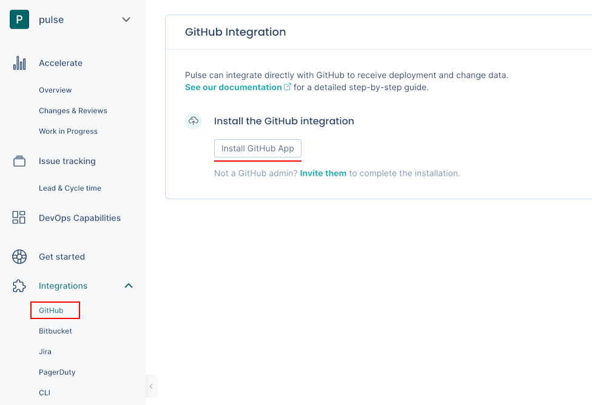
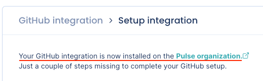

# GitHub integration

Pulse integrates with GitHub Cloud to receive data about changes, deployments, and incidents, necessary to calculate the metrics:

-   [Deployment frequency](../metrics/accelerate.md#deployment-frequency)

-   [Lead time for changes](../metrics/accelerate.md#lead-time-for-changes), including the following drill-down metrics:

    -   [Changes metrics](../metrics/accelerate-changes.md#changes-metrics)

    -   [Reviews metrics](../metrics/accelerate-changes.md#reviews-metrics)

    -   [Work in progress metrics](../metrics/accelerate-wip.md)

-   [Time to recover](../metrics/accelerate.md#time-to-recover)

-   [Change failure rate](../metrics/accelerate.md#change-failure-rate)

## Setting up the GitHub integration

!!! note
    -   You can only install the Pulse GitHub App on an **organization** and not on your personal account.
    -   [See below](#gh-permissions) the permissions that Pulse requires from your GitHub account.

To set up the GitHub integration:

1.  On Pulse, [expand **Integrations** and select **GitHub**](https://app.pulse.codacy.com/integrations/github){: target="_blank"}.

1.  Click **Install GitHub App** and follow the instructions on the GitHub UI to install the app on your **organization**.

    

1.  Confirm that Pulse successfully [installed the GitHub app](https://docs.github.com/en/organizations/managing-programmatic-access-to-your-organization/reviewing-your-organizations-installed-integrations) and created the [webhook](https://docs.github.com/en/developers/webhooks-and-events/webhooks/about-webhooks) on GitHub. If there is an error please [contact support](mailto:pulsesupport@codacy.com).

    

1.  Choose the strategy to detect **deployments** that best fits your workflows. See the [section below](#deployment-detection-strategy) for a detailed description of each option.

    

1.  Choose the strategy to detect **incidents** that best fits your workflows. See the [section below](#incident-detection-strategy) for a detailed description of each option.

    

1.  Click **Complete setup**.

Your GitHub integration is now complete. Pulse will start loading your data for the last 90 days.


## Automatic deployment detection strategies {: id="deployment-detection-strategy"}

The following is a detailed description of how the Pulse GitHub integration automatically detects deployment using each detection strategy:

### Use merged pull requests (based on default branch)

-   Pulse considers a deployment every merged pull request that **targets the default branch** of the repository.
-   The deployment date is the timestamp when the corresponding pull request is merged.
-   The set of changes in a deployment is the list of commits in the corresponding pull request. Pulse correctly tracks your changes even if you [squash or rebase the commits when merging the pull request](https://docs.github.com/en/repositories/configuring-branches-and-merges-in-your-repository/configuring-pull-request-merges/about-merge-methods-on-github), since Pulse processes all the original commits before any changes to the Git history.
-   Pulse associates all GitHub teams of the author of a merged pull request with the corresponding deployment, excluding teams with less than two members. Pulse only takes changes to GitHub teams into account on pull requests merged after those changes.

### Use semantic versioning tags

-   Pulse considers a deployment every Git tag that follows the [SemVer](https://semver.org) convention, excluding pre-release versions but allowing release prefixes. For example, the following are valid tags: `1.0.0`, `v2.3.4`.

    To use this strategy, make sure that you're creating Git tags on your repositories for each successful deployment to production, or whenever you make a new release available to any user of your application:

    ```bash
    git tag -a MAJOR.MINOR.PATCH -m "<Deployment or release message>"
    ```

    Where `MAJOR.MINOR.PATCH` must be a valid SemVer version without pre-release information. [Check if your versioning syntax is valid](https://regex101.com/r/NVAtiz/1).

-   The deployment date is either the creation date of [annotated tags](https://git-scm.com/book/en/v2/Git-Basics-Tagging#_annotated_tags) or the timestamp when Pulse receives the webhook calls for [lightweight tags](https://git-scm.com/book/en/v2/Git-Basics-Tagging#_lightweight_tags).

    Keep in mind that since webhook calls can be delayed, the deployment date on Pulse could be imprecise and impact the metric **Lead time for changes**.

-   The set of changes that belong to a deployment is the list of commits between the tag of that deployment and the previous tag. Because of this, Pulse discards:

    -   The first SemVer tag in the repository since there is no previous tag to compare with.
    -   Any tag that doesn't have a common ancestor (commit) with its previous tag, since Pulse can't obtain the changes between them.

-   Pulse associates all GitHub teams of the person who creates a Git tag with the corresponding deployment, excluding teams with less than two members. Pulse only takes changes to GitHub teams into account on Git tags created after those changes.

### Use the CLI or API (don't detect deployments automatically)

-   Pulse doesn't detect deployments automatically using GitHub events.

    This is useful if none of the automatic deployment detection strategies match your workflow and you must have control over the way Pulse tracks your deployments.

-   In this case, you must send to Pulse the information about your **deployments** and the corresponding **changes** using the [Pulse CLI](../cli/cli.md) or the [Ingestion API](https://ingestion.pulse.codacy.com/v1/api-docs).

## Automatic incident detection strategies {: id="incident-detection-strategy"}

The following is a detailed description of how the Pulse GitHub integration automatically detects incidents:

### Use pull request reverts (based on default branch)

-   Pulse bases incident detection on [pull request reverts](https://docs.github.com/en/pull-requests/collaborating-with-pull-requests/incorporating-changes-from-a-pull-request/reverting-a-pull-request).
-   Pulse considers an incident any pull request that **targets the default branch** of the repository merged from a branch whose name starts with `revert-`, getting the number of the reverted pull request from the branch name, `revert-<pull request number>`. If you change the name of the branch created by GitHub when you revert a pull request, Pulse may not be able to obtain the incident data correctly.
-   The incident creation date is the timestamp when the reverted pull request was initially merged. If Pulse can't get the reverted pull request number from the branch name, the incident creation date is the timestamp of the first commit to the incident pull request.
-   Pulse associates incidents to the system matching the repository name.

### Don't detect incidents via GitHub

-   Pulse doesn't detect incidents automatically using GitHub events.

    Choose this option if you want to send to Pulse the information about your **incidents** using another Pulse integration - [PagerDuty one-click integration](pagerduty-integration.md), [Pulse CLI](../cli/cli.md), or [Ingestion API](https://ingestion.pulse.codacy.com/v1/api-docs) - or if you don't want Pulse to track incidents data.

## Collected data

The table below lists the data that the GitHub integration collects from your GitHub organization, together with:

-   The mapping between the data collected from GitHub and the [Pulse data model](https://ingestion.pulse.codacy.com/v1/api-docs#tocs_event)
-   The metrics that Pulse displays on the dashboards, calculated using the collected data

<table>
<thead>
<tr>
<th><strong>Data collected from GitHub</strong></th>
<th><strong>Mapping to Pulse data model</strong></th>
<th><strong>Used in</strong></th>
</tr>
</thead>
<tbody>
<tr>
    <td>Pull request commits</td>
    <td>
        <p>Changes:</p>
        <ul>
            <li><code>change_id</code>: commit UUID</li>
            <li><code>time_created</code>: commit author date<sup><a href="#commit-author-date">1</a></sup></li>
            <li><code>system</code>: repository name</li>
        </ul>
    </td>
    <td>Lead time for changes on the <a href="../../metrics/accelerate/">Accelerate Overview dashboard</a></td>
</tr>
<tr>
    <td>Pull requests, git tags, or none (<a href="#deployment-detection-strategy">configurable</a>)</td>
    <td>
        <p>Deployments:</p>
        <ul>
            <li><code>deploy_id</code>: pull request identifier</li>
            <li><code>timestamp_created</code>: pull request merged date</li>
            <li><code>system</code>: repository name</li>
        </ul>
    </td>
    <td>Deployment frequency and Change failure rate on the <a href="../../metrics/accelerate/">Accelerate Overview dashboard</a></td>
</tr>
<tr>
<td>Pull requests</td>
    <td>
        <p>Incidents:</p>
        <ul>
            <li><code>incident_id</code>: pull request identifier</li>
            <li><code>timestamp_created</code>: reverted pull request merged date</li>
            <li><code>timestamp_resolved</code>: pull request merged date</li>
            <li><code>system</code>: repository name</li>
        </ul>
    </td>
    <td>Time to recover and Change failure rate on the <a href="../../metrics/accelerate/">Accelerate Overview dashboard</a></td>
</tr>
<tr>
    <td>Pull requests</td>
    <td>
        -
    </td>
    <td><a href="../../metrics/accelerate-changes/">Changes & Reviews dashboard</a>,<br/><a href="../../metrics/accelerate-wip/">Work in Progress dashboard</a></td>
</tr>
<tr>
    <td>Teams</td>
    <td>
        <p>Deployments:</p>
        <ul>
            <li><code>teams</code>: GitHub teams of the author of a deployment<sup><a href="#deployment-teams">2</a></sup></li>
        </ul>
    </td>
    <td>Filters the <a href="../../metrics/accelerate/">Accelerate Overview dashboard</a>, <a href="../../metrics/accelerate-changes/">Changes & Reviews dashboard</a>, and <a href="../../metrics/accelerate-wip/">Work in Progress dashboard</a> by the contributions made by the team</td>
</tr>
</table>

<sup><span id="commit-author-date">1</span></sup>: Pulse uses the commit author's date since it's more accurate. The committer date can be changed (for example, with a rebase) and stop reflecting the real creation date of the change.

<sup><span id="deployment-teams">2</span></sup>: Adding a new team or changing the composition of a team on GitHub only affects new data starting from that moment and doesn't have an immediate impact on the dashboards. Also, deleted teams on GitHub are still visible in Pulse.

## Which permissions does Pulse need from GitHub? {: id="gh-permissions"}

Pulse requests only the necessary permissions from GitHub to collect changes and deployment data from the repositories in your organization and [keeps your information secure](https://security.codacy.com/). See below the detailed list of permissions.

<table>
  <colgroup>
    <col width="20%"/>
    <col width="20%"/>
    <col width="60%"/>
  </colgroup>
  <thead>
    <tr>
      <th>Scope</th>
      <th>Permissions</th>
      <th>Description</th>
    </tr>
  </thead>
  <tbody>
    <tr>
      <td colspan="3"><strong>Repository permissions:</strong></td>
    </tr>
    <tr>
      <td>Pull requests</td>
      <td>Read</td>
      <td>Pulse retrieves pull request information to calculate several metrics presented on the dashboards. <a href="#collected-data">See the details here.</a></td>
    </tr>
    <tr>
      <td>Contents</td>
      <td>Read</td>
      <td>Pulse retrieves tag information to track deployments via semantic versioning tags. For this, the Pulse GitHub App requires read permission on the contents of files and directories, as it's the same permission that applies to tags.</td>
    </tr>
    <tr>
      <td>Issues</td>
      <td>Read</td>
      <td>Pulse retrieves issue information to get the top-level comments of pull requests.</td>
    </tr>
    <tr>
      <td colspan="3"><strong>Organization permissions:</strong></td>
    </tr>
    <tr>
      <td>Webhooks</td>
      <td>Read & Write</td>
      <td>Pulse creates organization webhooks to track new or deleted repositories, and the status of the integration.<br/>Pulse also creates webhooks subscribed to the following repository events as a trigger to gather the corresponding data in real time:
      <ul>
        <li><code>create</code>: tags creation</li>
        <li><code>pull_request</code>: pull requests creation, edition, and deletion</li>
        <li><code>pull_request_review</code>: review creation, edition, and deletion</li>
      </ul></td>
    </tr>
    <tr>
      <td>Members</td>
      <td>Read</td>
      <td>Pulse retrieves information about members and teams of your organization to filter metrics and for billing purposes.</td>
    </tr>
  </tbody>
</table>

## See also

-   [Accelerate metrics](../metrics/accelerate.md)
-   [Changes and reviews metrics](../metrics/accelerate-changes.md)
-   [Work in progress metrics](../metrics/accelerate-wip.md)
