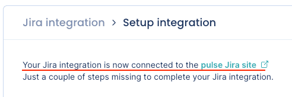
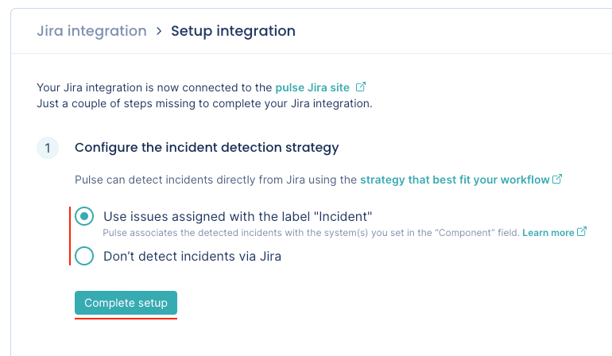
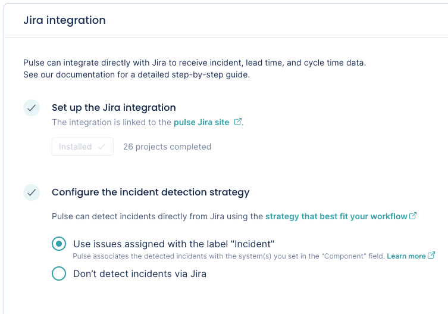

# Jira integration

Pulse integrates with Jira Cloud to receive data about:

-   **Issues** - necessary to calculate [Lead time and Cycle time](../metrics/lead-cycle-time.md).

-   **Incidents** - necessary to calculate the following Accelerate metrics:

    -   [Time to recover](../metrics/accelerate.md#time-to-recover)

    -   [Change failure rate](../metrics/accelerate.md#change-failure-rate)

## Setting up the Jira integration

!!! note
    -   A **Jira administrator** must set up the integration, as Pulse will only have access to Jira resources that the user setting up the integration has access to.
    -   You can only integrate one Pulse organization with each Jira instance.
    -   If you want to report incidents using Jira, [review the details of the incident detection strategy](#incident-detection-strategy) before you proceed with the integration setup.
    -   [See below](#jira-permissions) the permissions that Pulse requires from your Jira instance.

To set up the Jira integration:

1.  On Pulse, [expand **Integrations** and select **Jira**](https://app.pulse.codacy.com/integrations/jira){: target="_blank"}.

1.  Click **Install Jira App** and follow the instructions on the Jira UI to install the app. You must be a Jira administrator to proceed with this step.

    

1.  Confirm that Pulse successfully connected the integration to Jira. If there is an error please [contact support](mailto:pulsesupport@codacy.com).

    

1.  Choose the strategy to detect incidents that best fits your workflows. See the [section below](#incident-detection-strategy) for a detailed description of each option.

    

1.  Click **Complete setup**.

Your Jira integration is now complete. Pulse will start loading your data for the last 90 days.

## Automatic incident detection strategies {: id="incident-detection-strategy"}

The Pulse Jira integration can detect **incidents** automatically using the [issues assigned with the label `Incident`](#jira-incident-label).

You can also choose [not to detect incidents via Jira](#jira-incident-not-detect).

### Use issues assigned with the label "Incident" {: id="jira-incident-label"}

-   Pulse considers an incident every completed Jira issue assigned with the label `Incident` (case-insensitive). An issue is completed when its status maps to the **Done status category** in Jira. [See below](#collected-data) how Pulse collects issue status data from Jira.

-   Pulse associates an incident to one or more systems matching the values in the **Component(s)** field of the Jira issue (case-sensitive).

    -   If the Jira issue is set with more than one component, Pulse creates an incident for each existing system that matches a component name, ignoring the remaining components that don't exist in Pulse as a system.

    -   If the **Component(s)** field in the Jira issue is empty, or none of the components exist in Pulse as a system, Pulse creates an incident and associates it with the system `_unknown_`.

-   The incident creation date is the timestamp when the Jira issue was created, while the incident resolution date is the timestamp when the Jira issue was last completed.

-   Pulse creates new incidents when the following updates are performed in Jira:

    -   An issue assigned with the label `Incident` is completed. Pulse creates one or more incidents, depending on the values in the **Component(s)** field.

    -   A completed issue is assigned with the label `Incident`. Pulse creates one or more incidents, depending on the values in the **Component(s)** field.

    -   A new component that matches an existing system is added to a completed issue assigned with the label `Incident`. Pulse creates a new incident associated with the matching system.

-   Pulse deletes an existing incident when the following updates are performed in Jira:

    -   The corresponding issue is re-opened.

    -   The label `Incident` is removed from the corresponding issue.

    -   A component that matches an existing system is removed from the corresponding issue. Pulse deletes the incident for that system.

    -   The corresponding issue is deleted.

!!! important
    After completing the Jira integration setup, Pulse starts loading your incident data for the last 90 days. Therefore, **before you perform the integration setup**, make sure the corresponding Jira issues follow the rules described above, so Pulse can load your historical data correctly.
    Pulse will only create incidents for the completed Jira issues that are assigned with the label `Incident`, and associates them with the systems matching the values in the **Component(s)** field as described above.

### Don't detect incidents via Jira {: id="jira-incident-not-detect"}

-   Pulse doesn't detect incidents automatically using Jira events.

    Choose this option if you want to send to Pulse the information about your **incidents** using another Pulse integration - [GitHub one-click integration](github-integration.md) or [Bitbucket one-click integration](bitbucket-integration.md), [PagerDuty one-click integration](pagerduty-integration.md), [Pulse CLI](../cli/cli.md), or [Ingestion API](https://ingestion.pulse.codacy.com/v1/api-docs) - or if you don't want Pulse to track incidents data.

## Collected data

The table below lists the data that the Jira integration collects from your Jira instance and the metrics that Pulse displays on the dashboards, calculated using the collected data.

<table>
<thead>
<tr>
<th><strong>Data collected from Jira</strong></th>
<th><strong>Details</strong></th>
<th><strong>Used in</strong></th>
</tr>
</thead>
<tbody>
    <tr>
        <td>Issues</td>
        <td>
            Issue data includes all issue status transitions.  
            To detect the state of an issue, Pulse considers all the statuses under each <a href="https://support.atlassian.com/jira-work-management/docs/workflows-and-statuses-for-the-board/">Jira status category</a>:
            <ul>
                <li>An issue is <strong>not being worked on</strong> when its status maps to the <strong>To-do status category</strong>, represented by the grey color in Jira. For example, <strong>BACKLOG</strong>, <strong>WAITING FOR APPROVAL</strong>, or any other custom value.</li>
                <li>An issue is <strong>in progress</strong> when its status maps to the <strong>In-progress status category</strong>, represented by the blue color in Jira. For example, <strong>IN PROGRESS</strong>, <strong>DEVELOPING</strong>, <strong>IN REVIEW</strong>, or any other custom value.</li>
                <li>An issue is <strong>completed</strong> when its status maps to the <strong>Done status category</strong>, represented by the grey color in Jira. For example, <strong>DONE</strong>, <strong>CLOSED</strong>, <strong>DECLINED</strong>, or any other custom value.</li>
            </ul>
        </td>
        <td>Lead time and Cycle time on the <a href="../../metrics/lead-cycle-time/">Lead & Cycle time dashboard</a></td>
    </tr>
    <tr>
        <td>Projects</td>
        <td>
            Project data includes the name of the Jira projects.
        </td>
        <td>Filters on the <a href="../../metrics/lead-cycle-time/">Lead & Cycle time dashboard</a></td>
    </tr>
    <tr>
        <td>Issue types</td>
        <td>
            Pulse groups issue types per name since in Jira you can have the same issue type name in different projects.  
            This means that, for example, the Pulse UI will group different issue types named <strong>Subtask</strong> and <strong>Sub-task</strong> under the name of the issue type that was processed first. For all effects, these issue types are the same for Pulse.
        </td>
        <td>Filters on the <a href="../../metrics/lead-cycle-time/">Lead & Cycle time dashboard</a></td>
    </tr>
    <tr>
        <td>Issues</td>
        <td>
            Pulse detects <strong>incidents</strong> from issue data according to the <a href="#incident-detection-strategy">defined strategy</a>.
        </td>
        <td>Time to recover and Change failure rate on the <a href="../../metrics/accelerate/">Accelerate Overview dashboard</a></td>
    </tr>
</table>

## Which permissions does Pulse need from Jira? {: id="jira-permissions"}

Pulse requests only the necessary [permissions/scopes from your Atlassian account](https://developer.atlassian.com/cloud/jira/platform/scopes-for-oauth-2-3LO-and-forge-apps/) to collect issues data from your Jira instance and [keeps your information secure](https://security.codacy.com/). See below the detailed list of permissions.

<table>
  <colgroup>
    <col width="25%"/>
    <col width="75%"/>
  </colgroup>
  <thead>
    <tr>
      <th>Classic scope</th>
      <th>Description</th>
    </tr>
  </thead>
  <tbody>
    <tr>
      <td><code>read:me</code></td>
      <td>Pulse retrieves the email of the user installing the integration.</td>
    </tr>
    <tr>
      <td><code>read:jira-work</code></td>
      <td>Pulse requires this scope to perform the following actions:
      <ul>
        <li>List all issue statuses associated with the active workflows to identify the transitions of the issue status, required to detect when an issue is closed or re-opened.</li>
        <li>Get the details of an issue for real-time processing.</li>
        <li>List projects to use on dashboard filters.</li>
        <li>List the closed issues of a project for historical data loading.</li>
      </ul>
    </tr>
    <tr>
      <td><code>manage:jira-webhook</code></td>
      <td>Pulse uses Jira webhooks to retrieve data in real time. </td>
    </tr>
  </tbody>
</table>

## See also

-   [Lead and Cycle time metrics](../metrics/lead-cycle-time.md)
-   [Time to recover](../metrics/accelerate.md#time-to-recover)
-   [Change failure rate](../metrics/accelerate.md#change-failure-rate)
