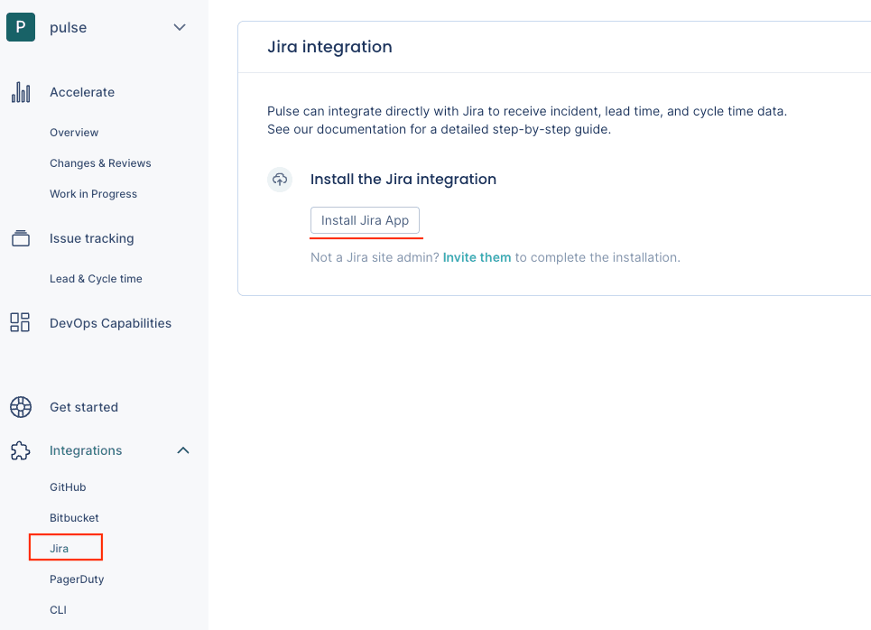

# Jira integration

Pulse integrates with Jira to receive data about issues, necessary to calculate the metrics [Lead time](#) and [Cycle time](#).

## Setting up the Jira integration

To set up the GitHub integration:

1.  On Pulse, [expand **Integrations** and select **Jira**](https://app.pulse.codacy.com/integrations/jira){: target="_blank"}.

1.  Click **Install Jira** and follow the instructions on the Jira UI to install the app.

    <!---->

1.  Wait until you get a confirmation that Pulse successfully created the integration and necessary webhooks on Jira.

    If there was an error please [contact support](mailto:pulsesupport@codacy.com).

## Collected data

The table below lists the data that the Jira integration collects from your Jira issues, together with:

-   The mapping between the data collected from Jira and the [Pulse data model](https://ingestion.pulse.codacy.com/v1/api-docs#tocs_event)
-   The metrics that Pulse calculates from the data to display on the dashboards

<table>
<thead>
<tr>
<th><strong>Data collected from Jira</strong></th>
<th><strong>Mapping to Pulse data model</strong></th>
<th><strong>Used in</strong></th>
</tr>
</thead>
<tbody>
<tr>
    <td>-</td>
    <td>
        -
    </td>
    <td>-</td>
</tr>
</table>
