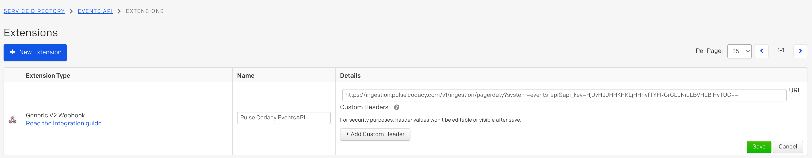

# PagerDuty integration

Pulse integrates directly with PagerDuty to receive data about incidents, necessary to calculate the metrics [Median time to recover](../metrics/accelerate.md#median-time-to-recover) and [Change failure rate](../metrics/accelerate.md#change-failure-rate).

To set up the PagerDuty integration:

1.  On Pulse, [expand **Integrations** and select **PagerDuty**](https://app.pulse.codacy.com/integrations/pagerduty){: target="_blank"}.

    

1.  Fill in the necessary details:

    -   **PagerDuty subdomain:** Your custom PagerDuty subdomain. For example, `mysubdomain` if you use the URL `https://mysubdomain.pagerduty.com` to access PagerDuty.
    -   **Pulse system name:** Name of the [system](https://docs.pulse.codacy.com/#before-you-begin) to associate with the incidents reported by this integration.

1.  Follow the instructions on the Pulse UI to create a new webhook on PagerDuty using the provided URL. For example:

    
